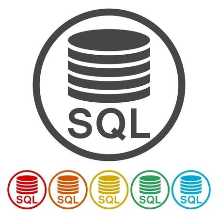
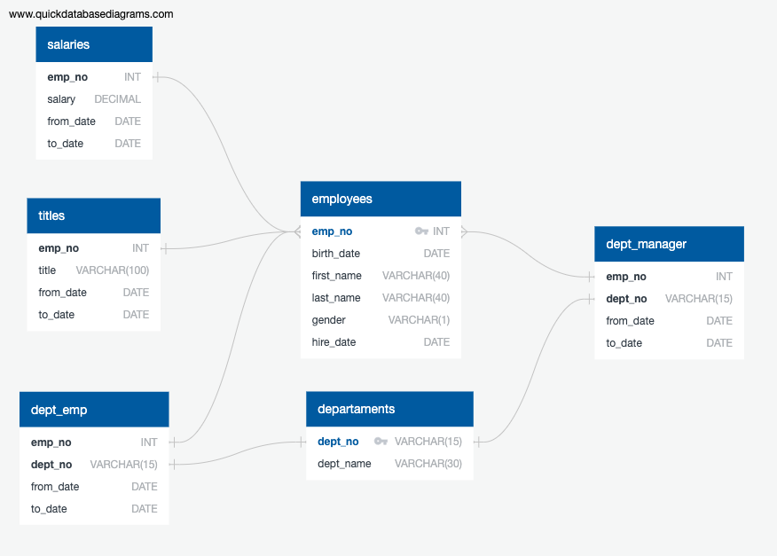
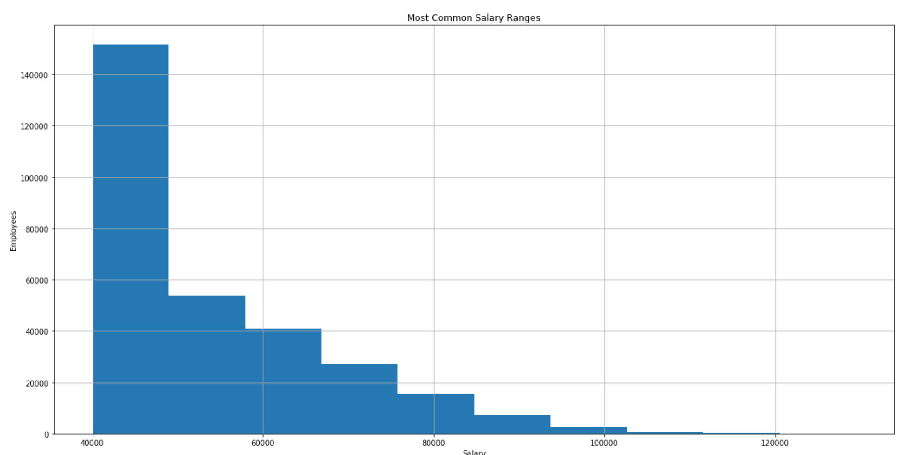
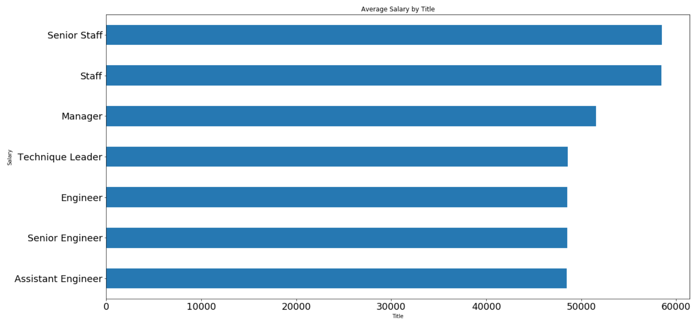

# SQL-Employee-Database

      

In this project, tables were designed to hold data from CSV files, in other words the objective was import CSV files into a SQL database, and then answer some questions about the data.

### Tools

The following tools were used to do the analysis and create the database

+ SQL (PostrgreSQL)
+ Jupyter Notebook
+ Python
    + sqlalchemy
    + pandas
    + matplotlib.pyplot

## Data

The data was provided by Tec de Monterrey, here is the schema:

 

## Analysis

A report was generated with the following data insights:

- Details of each employee: employee number, last name, first name, gender, and salary.
- List employees who were hired in 1986.
- List the manager of each department with the following information: department number, department name, the manager's employee number, last name, first name, and start and end employment dates.
- List the department of each employee with the following information: employee number, last name, first name, and department name.
- List all employees whose first name is "Hercules" and last names begin with "B."
- List all employees in the Sales department, including their employee number, last name, first name, and department name.
- List all employees in the Sales and Development departments, including their employee number, last name, first name, and department name.

Beside this information two charts were generated showing the most common salaries of the employees in the company and the average salary by title.
We can notice that Senior Staff position have better incomes and the most common salary round over 40K and 50K

      
      